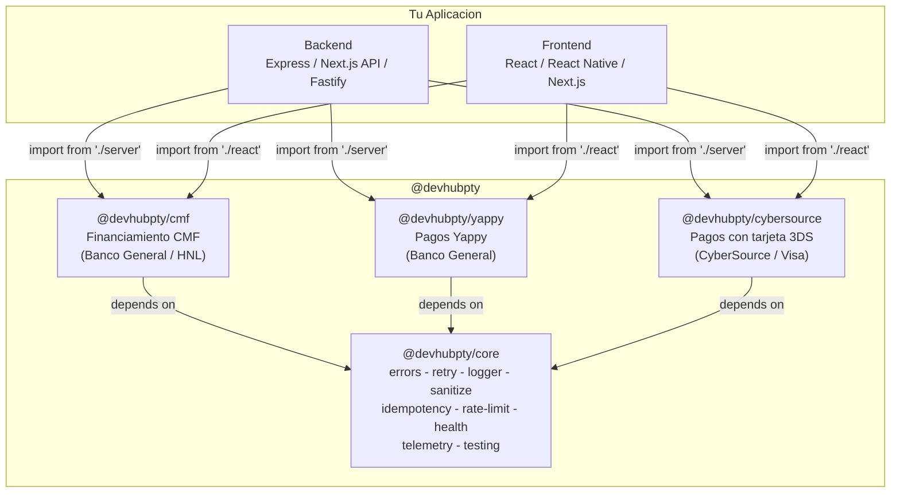
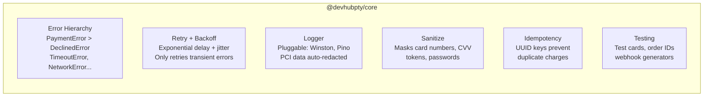
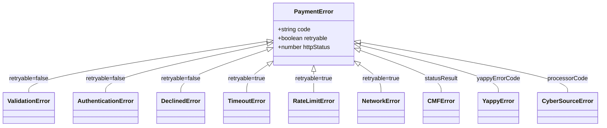

# Panama Payment Methods

Open-source TypeScript SDKs for Panamanian payment methods. Built for developers integrating **CMF (financing)**, **Yappy (mobile payments)**, and **CyberSource (card payments with 3DS)** into their applications.

> Created by [captainsparrow10](https://github.com/captainsparrow10) & [Reddsito](https://github.com/Reddsito)

## Architecture



## Packages

| Package | Description | Server | React | Docs |
|---------|-------------|--------|-------|------|
| [`@devhubpty/core`](./packages/core/) | Shared utilities (errors, retry, logger, PCI redaction) | - | - | [README](./packages/core/README.md) |
| [`@devhubpty/cmf`](./packages/cmf/) | CMF financing (HNL / Banco General) | `./server` | `./react` | [Docs](./packages/cmf/docs/) |
| [`@devhubpty/yappy`](./packages/yappy/) | Yappy mobile payments (Banco General) | `./server` | `./react` `./vanilla` | [Docs](./packages/yappy/docs/) |
| [`@devhubpty/cybersource`](./packages/cybersource/) | CyberSource 3DS card payments | `./server` | `./react` | [Docs](./packages/cybersource/docs/) |

## Quick Start

### CMF — Financiamiento en cuotas

```typescript
// Backend (Node.js)
import { CMFClient, CMFDocumentType } from '@devhubpty/cmf/server';

const cmf = new CMFClient({
  baseUrl: process.env.CMF_URL!,
  email: process.env.CMF_EMAIL!,
  password: process.env.CMF_PASSWORD!,
  branchOfficeCode: process.env.CMF_BRANCH_OFFICE_CODE!,
  companyCode: process.env.CMF_COMPANY_CODE!,
  createdBy: 'system',
});

await cmf.ensureAuthenticated();
const customer = await cmf.getCustomerByDocument(CMFDocumentType.Cedula, '8-123-456');
const quotas = await cmf.getQuotas(customer.products[0].customerProductId, 500);
```

```typescript
// Frontend (React)
import { useCMFCustomer, useCMFQuotas, CMFDocumentType } from '@devhubpty/cmf/react';

const { search, customer, products } = useCMFCustomer();
const { getQuotas, quotas } = useCMFQuotas();

await search(CMFDocumentType.Cedula, '8-123-456');
await getQuotas(products[0].customerProductId, 500);
```

### Yappy — Pagos moviles

```typescript
// Backend
import { YappyClient } from '@devhubpty/yappy/server';

const yappy = new YappyClient({
  merchantId: process.env.YAPPY_MERCHANT_ID!,
  domain: process.env.YAPPY_URL_DOMAIN!,
}, { environment: 'sandbox' });

const { transactionId } = await yappy.initiatePayment({
  orderId: 'ORDER-123',
  total: 25.00,
  subtotal: 25.00,
  taxes: 0,
  discount: 0,
  ipnUrl: 'https://mystore.com/api/webhooks/yappy',
});
```

```typescript
// Webhook validation
import { validateYappyHash, YappyStatus } from '@devhubpty/yappy/server';

const result = validateYappyHash(req.query, process.env.CLAVE_SECRETA!);
if (result.valid && result.status === YappyStatus.Executed) {
  // Payment confirmed!
}
```

### CyberSource — Pagos con tarjeta (3DS)

```typescript
// Backend
import { CyberSourceClient, CyberSourceEnvironment } from '@devhubpty/cybersource/server';

const cs = new CyberSourceClient({
  merchantId: process.env.CYBERSOURCE_MERCHANT_ID!,
  keyId: process.env.CYBERSOURCE_KEY!,
  sharedSecretKey: process.env.CYBERSOURCE_SHARED_SECRET_KEY!,
  runEnvironment: CyberSourceEnvironment.Test,
});

// 3DS flow
const setup = await cs.setupAuthentication({ paymentInstrumentId, cybersourceCustomerId, sessionId });
const enrollment = await cs.checkEnrollment({ referenceId: setup.referenceId, amount: '50.00', ... });
const payment = await cs.processPayment({ auth3DSResult, amount: '50.00', ... });
```

```typescript
// Frontend (React) — orchestrator hook
import { useThreeDS } from '@devhubpty/cybersource/react';

const { step, startAuth, completeChallenge, challengeRequired, challengeUrl } = useThreeDS({
  onAuthenticated: (auth3DS) => processPayment(auth3DS),
});
```

## Shared Features (via @devhubpty/core)

All 3 SDKs include these production-grade features:



### Error Hierarchy



## Development

```bash
# Install dependencies
pnpm install

# Type-check all packages
pnpm typecheck

# Build all packages
pnpm build

# Clean build artifacts
pnpm clean
```

## Project Structure

```
panama-payment-methos/
├── packages/
│   ├── core/           @devhubpty/core
│   ├── cmf/            @devhubpty/cmf          (./server + ./react)
│   ├── yappy/          @devhubpty/yappy         (./server + ./react + ./vanilla)
│   └── cybersource/    @devhubpty/cybersource   (./server + ./react)
├── pnpm-workspace.yaml
├── tsconfig.base.json
└── package.json
```

## Requirements

- Node.js >= 18.0.0
- pnpm >= 9.0.0
- TypeScript >= 5.0.0

## License

MIT - [captainsparrow10](https://github.com/captainsparrow10) & [Reddsito](https://github.com/Reddsito)
