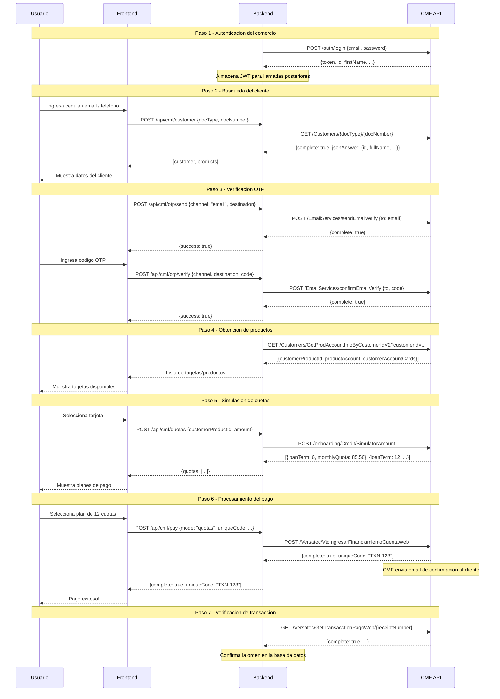
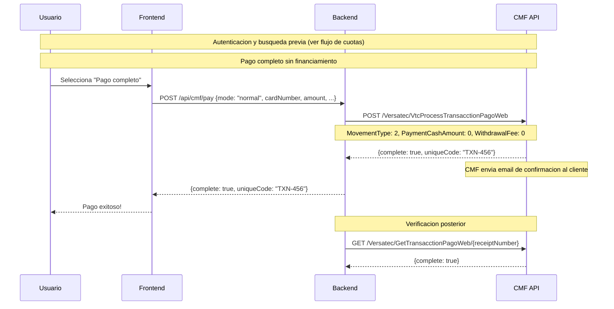
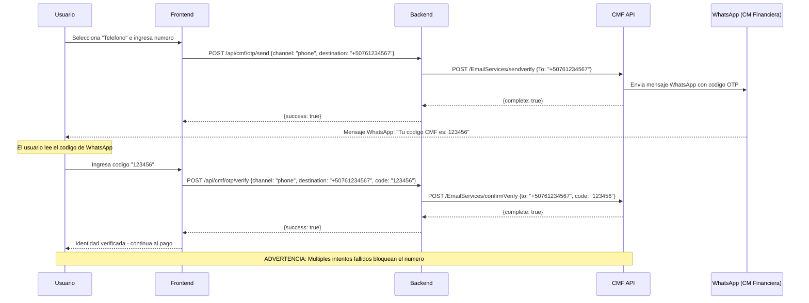
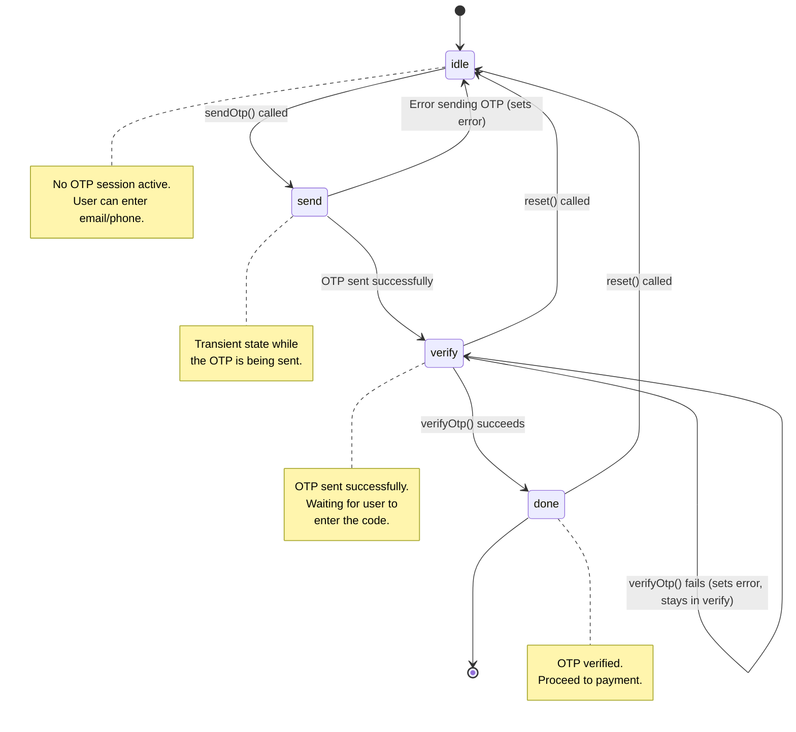

# Payment Flows

This document describes the complete payment flows supported by the CMF SDK, including sequence diagrams for each flow.

---

## 1. Flujo completo de compra en cuotas (Installment Purchase)

This is the most common flow. The customer selects a financing plan (6, 12, 18, 24 months) and pays in installments.



### Detalle de cada paso

**Paso 1 - Autenticacion**: El backend se autentica con las credenciales del comercio. El token JWT se almacena internamente y se reutiliza en todas las llamadas posteriores.

**Paso 2 - Busqueda del cliente**: Se busca al cliente en CMF por su cedula, email o telefono. Si el cliente no existe en CMF, no puede pagar con este metodo.

**Paso 3 - Verificacion OTP**: CMF envia un codigo de verificacion al email o WhatsApp del cliente. Este paso confirma la identidad del cliente antes de permitir el pago.

**Paso 4 - Obtencion de productos**: Se obtienen los productos de credito (cuentas) del cliente. Cada producto puede tener multiples tarjetas asociadas.

**Paso 5 - Simulacion de cuotas**: Se simulan los planes de financiamiento disponibles para el monto de la compra. CMF retorna multiples opciones (6, 12, 18, 24 meses).

**Paso 6 - Procesamiento del pago**: Se procesa la compra en cuotas usando el plan seleccionado por el cliente. CMF envia automaticamente un email de confirmacion.

**Paso 7 - Verificacion**: Se verifica que la transaccion fue registrada correctamente en CMF antes de confirmar la orden en la base de datos del comercio.

---

## 2. Flujo de compra normal (Normal Purchase)

Used when the customer wants to pay the full amount at once, without financing.



### Diferencias con el flujo de cuotas

- No se necesita simulacion de cuotas (paso 5 del flujo completo)
- Se usa `processNormalPurchase()` en lugar de `processPurchaseInQuotas()`
- El parametro `CardNumber` viene de `CMFAccountCard.card` (encriptado)
- El campo `MovementType` siempre es `2` para compras

---

## 3. Flujo OTP por WhatsApp (Phone OTP)

The OTP can be delivered via WhatsApp instead of email. The WhatsApp message is sent by CM Financiera / Banco General.



### Advertencias importantes

- **Bloqueo de numero**: Multiples intentos fallidos de verificacion bloquearan el numero de telefono en el proveedor de OTP de CMF. Implementa un limite maximo de 3 intentos en tu UI.
- **Formato de telefono**: El telefono debe incluir el codigo de pais. Para Panama: `+507` + 8 digitos.
- **Proveedor**: El mensaje de WhatsApp lo envia CM Financiera / Banco General, no tu aplicacion.

---

## 4. State machine de useCMFOtp

The `useCMFOtp` hook implements a state machine with four states:



### Estados

| Estado | Descripcion | Transiciones posibles |
|--------|------------|----------------------|
| `idle` | Estado inicial. No hay sesion OTP activa. | `send` (al llamar `sendOtp()`) |
| `send` | Estado transitorio mientras se envia el OTP. | `verify` (exito), `idle` (error) |
| `verify` | OTP enviado. Esperando que el usuario ingrese el codigo. | `done` (exito), `verify` (error, permanece), `idle` (reset) |
| `done` | OTP verificado exitosamente. | `idle` (reset) |

### Ejemplo de uso con el state machine

```tsx
const { sendOtp, verifyOtp, step, error, reset } = useCMFOtp();

switch (step) {
  case 'idle':
    // Show send OTP form
    return <button onClick={() => sendOtp(CMFOtpChannel.Email, email)}>Send Code</button>;

  case 'verify':
    // Show code input
    return (
      <div>
        <input onChange={(e) => setCode(e.target.value)} />
        <button onClick={() => verifyOtp(code)}>Verify</button>
        {error && <p>{error}</p>}
        <button onClick={reset}>Cancel</button>
      </div>
    );

  case 'done':
    // Proceed to payment
    return <p>Identity verified! Proceeding to payment...</p>;
}
```

---

## Error Handling

All flows should handle errors at each step. The SDK provides typed errors:

| Error Type | When | Retryable |
|-----------|------|-----------|
| `CMFError` | Business logic failure (`complete === false`) | No |
| `AuthenticationError` | Invalid credentials or expired token | No |
| `TimeoutError` | Request exceeded timeout (default 60s) | Yes |
| `NetworkError` | DNS failure, connection refused, 5xx | Yes |

```ts
import { CMFError } from '@panama-payments/cmf/server';
import { AuthenticationError, TimeoutError, NetworkError } from '@panama-payments/core';

try {
  await cmf.processPurchaseInQuotas(params);
} catch (error) {
  if (error instanceof CMFError) {
    // Business error -- show to user
    console.error(error.message, error.statusResult);
  } else if (error instanceof TimeoutError) {
    // Timeout -- safe to retry
    console.error(`Timeout after ${error.timeoutMs}ms`);
  } else if (error instanceof NetworkError) {
    // Network issue -- safe to retry
    console.error('Network error:', error.originalError?.message);
  } else if (error instanceof AuthenticationError) {
    // Bad credentials -- check env vars
    console.error('Auth failed:', error.message);
  }
}
```
