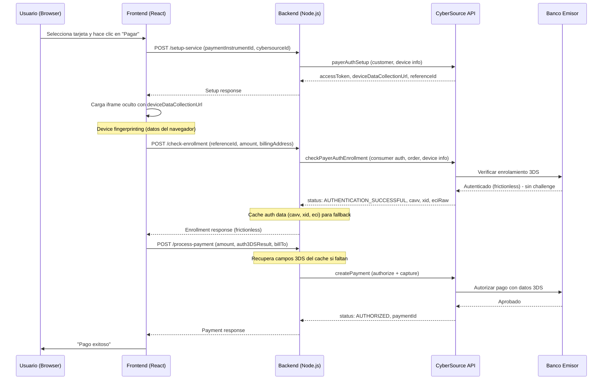
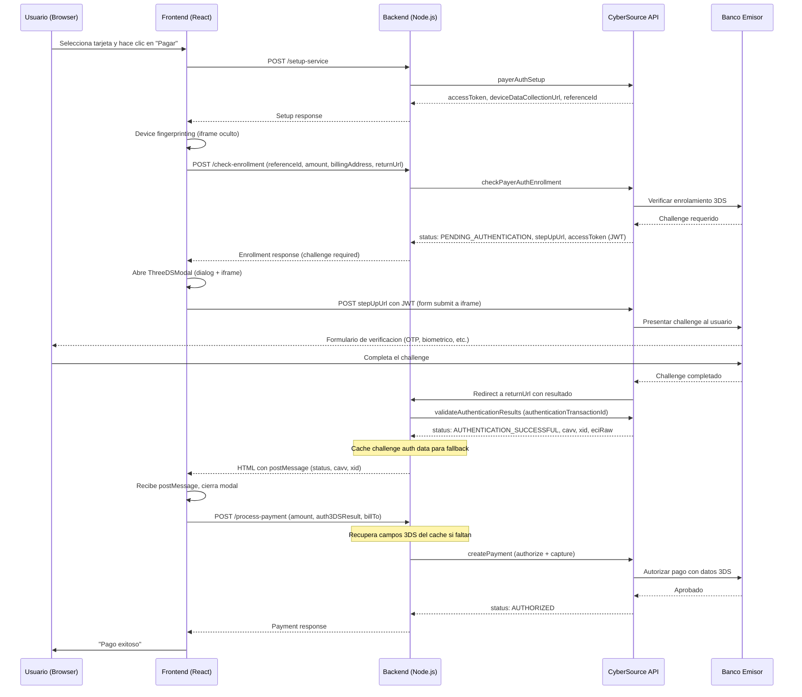
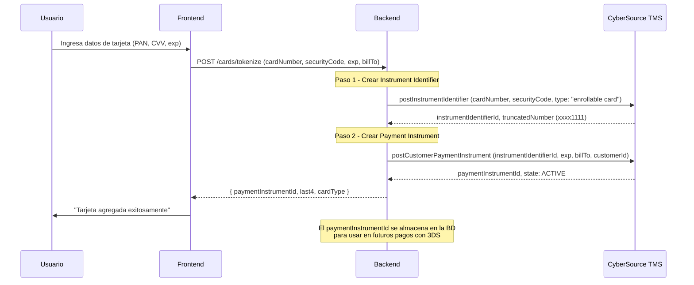
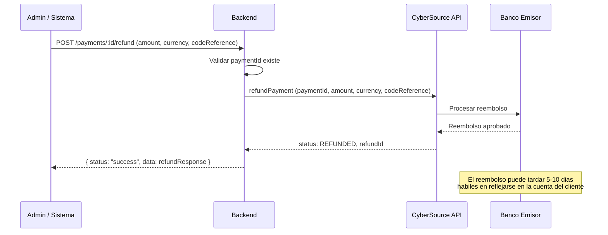
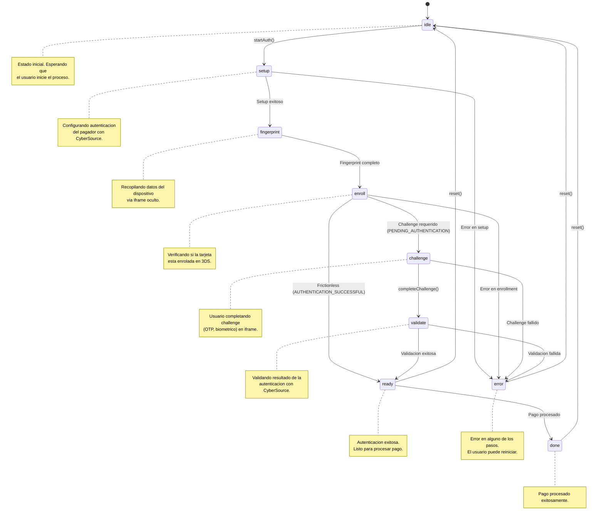

# Payment Flows

Visual diagrams of every CyberSource payment flow supported by this SDK.

---

## 1. 3DS Frictionless Flow

When the card issuer determines that no additional authentication is needed,
the flow completes without user interaction. The enrollment check returns
`AUTHENTICATION_SUCCESSFUL` directly.

En el flujo frictionless, el banco emisor decide que la transaccion es de bajo riesgo
y no requiere verificacion adicional del usuario. Los datos de autenticacion (cavv, xid, eci)
se obtienen directamente del enrollment check.

---

## 2. 3DS Challenge Flow

When the bank requires additional verification, the user is presented with
a challenge (e.g., OTP, biometric) in an iframe. After completing the challenge,
the authentication result is validated before proceeding to payment.

El flujo challenge se activa cuando el banco emisor detecta una transaccion de alto riesgo
o requiere verificacion adicional. El usuario debe completar un desafio (codigo OTP, biometria,
etc.) antes de que la autenticacion sea validada.

---

## 3. Tokenizacion de Tarjeta (2 pasos)

Card tokenization converts raw card data into reusable tokens stored in
CyberSource's Token Management Service (TMS). This is a 2-step process.

**Paso 1 (Instrument Identifier):** Tokeniza el numero de tarjeta y CVV. El token
resultante es un identificador reutilizable que representa la tarjeta sin almacenar
datos sensibles en tu servidor.

**Paso 2 (Payment Instrument):** Asocia el instrument identifier con un cliente de
CyberSource, datos de expiracion y direccion de facturacion. El payment instrument
resultante es lo que se usa para 3DS y pagos.

---

## 4. Flujo de Reembolso

Refunds can be processed for any previously captured payment.

Los reembolsos parciales son posibles -- simplemente especifica un monto menor
al total original. Cada reembolso genera un nuevo transaction ID.

---

## 5. State Machine `useThreeDS`

The `useThreeDS` hook manages the 3DS flow as a finite state machine.
Each state transition is triggered by the completion of the corresponding
API call or user action.

### Transiciones del State Machine

| Estado actual | Evento | Siguiente estado | Descripcion |
|--------------|--------|-----------------|-------------|
| `idle` | `startAuth()` | `setup` | Inicia el flujo 3DS |
| `setup` | Setup exitoso | `fingerprint` | Setup completado, inicia fingerprinting |
| `fingerprint` | Fingerprint completo | `enroll` | Datos del dispositivo recopilados |
| `enroll` | `AUTHENTICATION_SUCCESSFUL` | `ready` | Frictionless -- sin challenge |
| `enroll` | `PENDING_AUTHENTICATION` | `challenge` | Challenge requerido |
| `challenge` | `completeChallenge()` | `validate` | Usuario completo el challenge |
| `validate` | Validacion exitosa | `ready` | Autenticacion validada |
| `ready` | Pago procesado | `done` | Flujo completo |
| cualquiera | Error | `error` | Error en cualquier paso |
| `error` / `done` | `reset()` | `idle` | Reiniciar el flujo |
