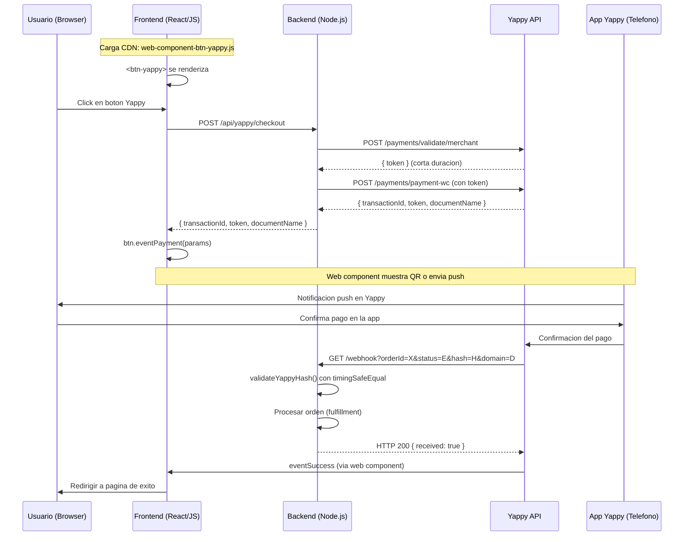
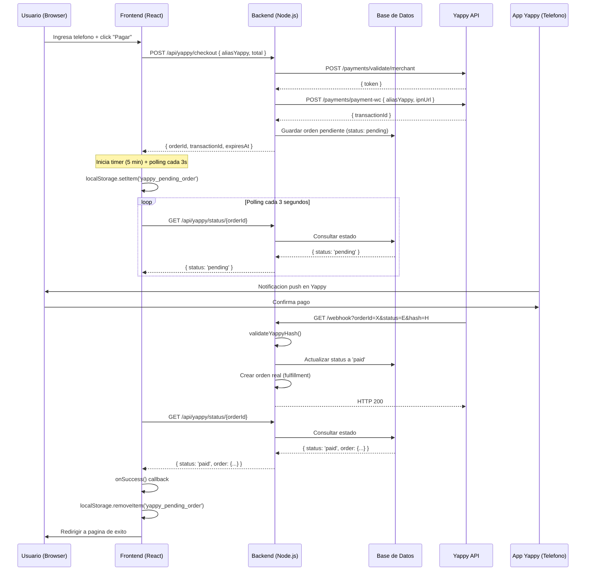
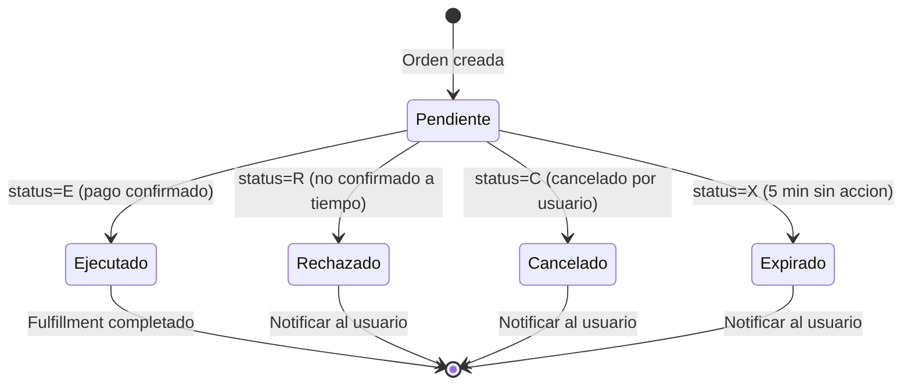
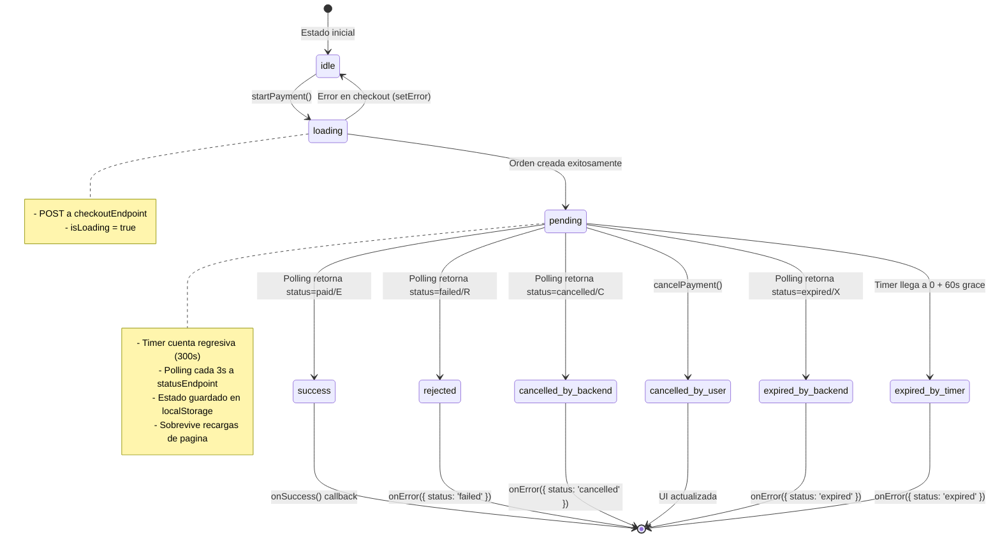

# Yappy Payment Flows

This document describes the two main integration approaches for Yappy payments, the webhook state machine, and the client-side state machine for the custom polling flow.

---

## Enfoque 1: Web Component oficial (CDN)

This is the recommended approach per Banco General's documentation. The official `<btn-yappy>` web component handles the payment UI, QR code display, and customer interaction.

Your frontend loads the CDN script, and when the user clicks the button, your backend creates the order and returns the params to the web component. The component then handles the rest of the flow, including showing the QR code or sending the push notification to the customer's Yappy app.

En este enfoque:
- El web component maneja toda la UI del pago (QR, estado de espera)
- El backend solo necesita crear la orden y manejar el webhook
- No se necesita polling del frontend
- El web component emite `eventSuccess` o `eventError` automaticamente

---

## Enfoque 2: Custom (polling, UI propia)

Use this approach when you want full control over the payment UI. Instead of the web component, you build your own phone input, pending modal with countdown timer, and status display.

Your backend creates the order (same as above), but instead of passing params to a web component, the frontend starts polling your backend for the order status. Your backend receives the webhook from Yappy and updates the order status in your database. The frontend detects the status change via polling and updates the UI.

En este enfoque:
- Tienes control total sobre la UI (modal personalizado, timer, estilos)
- El frontend hace polling para detectar cambios de estado
- Se persiste en localStorage para sobrevivir recargas de pagina
- El hook `useYappyPendingCheck` orquesta todo el flujo

---

## Estados del webhook

Yappy envia uno de cuatro estados via el webhook (query param `status`). Tu backend debe manejar cada uno de estos estados para actualizar el pedido en tu base de datos.

Los estados son mutuamente excluyentes y terminales: una vez que Yappy envia un webhook con un estado, no enviara otro para la misma orden.

| Status | Codigo | Significado | Accion recomendada |
|--------|--------|------------|-------------------|
| Ejecutado | `E` | Pago confirmado exitosamente | Crear orden, enviar confirmacion |
| Rechazado | `R` | Usuario no confirmo a tiempo | Marcar como fallido, permitir reintento |
| Cancelado | `C` | Usuario cancelo activamente | Marcar como cancelado |
| Expirado | `X` | 5 minutos sin respuesta | Marcar como expirado, permitir reintento |

---

## State machine: useYappyPendingCheck

Este diagrama muestra los estados internos del hook `useYappyPendingCheck`, que orquesta el flujo de pago personalizado en el frontend.

El hook inicia en `idle`, pasa a `loading` cuando se llama `startPayment()`, y luego a `pending` cuando la orden se crea exitosamente. Desde `pending`, puede transicionar a cualquiera de los estados terminales basado en la respuesta del polling o la expiracion del timer.

| Estado | Descripcion | Acciones activas |
|--------|------------|------------------|
| `idle` | Esperando que el usuario inicie el pago | Ninguna |
| `loading` | Llamando al endpoint de checkout | Fetch en curso |
| `pending` | Orden creada, esperando confirmacion | Timer + Polling + localStorage |
| `success` (paid) | Pago confirmado | onSuccess callback, redirect |
| `rejected` (failed) | Pago rechazado | onError callback |
| `cancelled` | Cancelado por usuario o backend | Limpieza de estado |
| `expired` | Tiempo expirado (5 min) | onError callback |

### Persistencia con localStorage

Cuando el estado es `pending`, el hook guarda los datos de la orden en `localStorage` bajo la clave `yappy_pending_order`. Si el usuario recarga la pagina:

1. El hook lee `localStorage` al montarse
2. Si hay una orden pendiente no expirada, reanuda el timer y el polling
3. Si la orden ya expiro, limpia `localStorage` y vuelve a `idle`

Esto garantiza que el usuario no pierda el estado de su pago si accidentalmente recarga la pagina durante los 5 minutos de espera.
